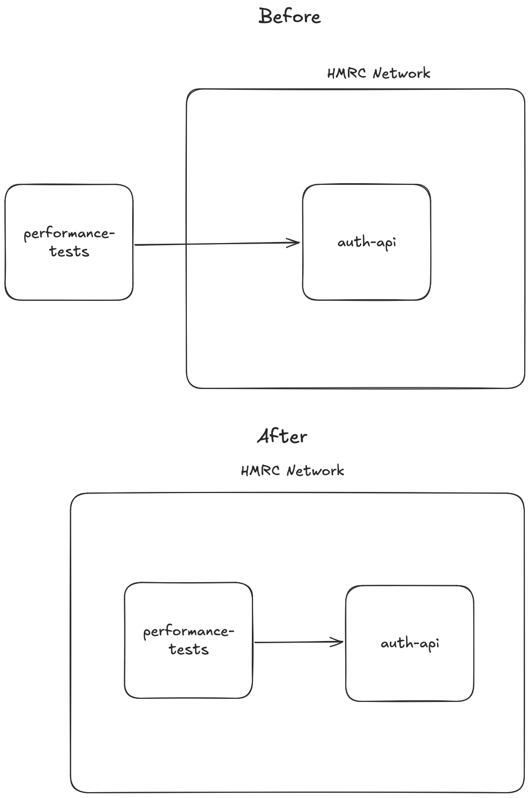

# trader-goods-profiles-api-performance-tests

Performance test suite for the `trader-goods-profile`, using [performance-test-runner](https://github.com/hmrc/performance-test-runner) under the hood.

These performance tests work slightly differently to the standard tests within HMRC. They generate an auth token before the run, 
then use this shared auth token for all requests, this was due to load of 10tps bringing down the auth service.

This means that you can't run these tests locally against the staging environment. If you wish to do so, you will do so from Jenkins.

This service has been configured to hit the auth service directly from inside the HMRC network. As can be seen from the [service.conf](src/test/resources/services.conf) file.

The reason for this change was to due to calling a different auth service that was only accessible in the private network.
The auth service used allowed for programmatic calling to get an auth token.   



## Pre-requisites

### Services

Start Mongo Docker container as follows:

```bash
docker run --rm -d -p 27017:27017 --name mongo mongo:4.4
```

Start `PLATFORM_TEST_EXAMPLE_UI_JOURNEY_TESTS` services as follows:

```bash
sm2 --start TGP_API
```

### Logging

The default log level for all HTTP requests is set to `WARN`. Configure [logback.xml](src/test/resources/logback.xml) to update this if required.

### WARNING :warning:

Do **NOT** run a full performance test against staging from your local machine. Please [implement a new performance test job](https://confluence.tools.tax.service.gov.uk/display/DTRG/Practical+guide+to+performance+testing+a+digital+service#Practicalguidetoperformancetestingadigitalservice-SettingupabuildonJenkinstorunagainsttheStagingenvironment) and execute your job from the dashboard in [Performance Jenkins](https://performance.tools.staging.tax.service.gov.uk).

## Tests

Run smoke test (locally) as follows:

```bash
./local-smoke-perf-tests.sh
```

Run full performance test (locally) as follows:

```bash
./local-perf-tests.sh
```

## Scalafmt

Check all project files are formatted as expected as follows:

```bash
sbt scalafmtCheckAll scalafmtCheck
```

Format `*.sbt` and `project/*.scala` files as follows:

```bash
sbt scalafmtSbt
```

Format all project files as follows:

```bash
sbt scalafmtAll
```

## License

This code is open source software licensed under the [Apache 2.0 License]("http://www.apache.org/licenses/LICENSE-2.0.html").
